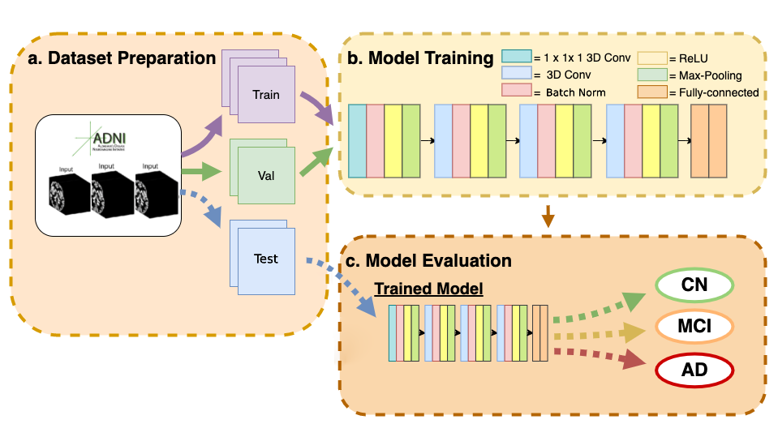
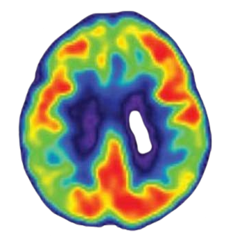
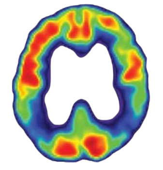

# Early Alzheimer’s Disease Detection from Structural MRIs Using Deep Learning

## 🧠 Overview

This project explores the use of **3D Convolutional Neural Networks (3D CNNs)** for early detection of Alzheimer’s Disease (AD) using structural magnetic resonance imaging (sMRI). Inspired by and building upon the work of Liu et al. (2022), we aim to not only replicate but **enhance their deep learning architecture** using high-performance computing (HPC) resources, particularly the **MeluXina Supercomputer**.

The model classifies subjects into three categories:  
- **Cognitively Normal (CN)**  
- **Mild Cognitive Impairment (MCI)**  
- **Mild AD Dementia (AD)**  

Our work highlights the value of deep learning in automating and improving the diagnostic process for Alzheimer’s Disease, enabling scalable and efficient MRI-based screening.

---

## ✅ Contributions

- Re-implemented and validated Liu et al.’s 3D CNN model on the ADNI dataset  
- Switched from instance normalization to batch normalization for improved training stability  
- Integrated advanced **data augmentation** techniques (rotation, flipping, Gaussian blurring, random cropping)  
- Leveraged **MeluXina HPC** for full-scale GPU-based training and evaluation  
- Used the **Clinica software suite** for standardized MRI preprocessing in BIDS format  
- Achieved promising classification results with potential for progression prediction

---

## 🏗️ Model Architecture



> *Note: Figure shows a placeholder representation of the deep learning architecture.*

The model architecture consists of:
- Multiple 3D convolutional blocks with batch normalization and ReLU activations  
- Dropout for regularization  
- Fully connected layers for classification  
- Cross-entropy loss optimized with Adam  

---

## 📦 Data Pipeline

### Dataset: [ADNI](http://adni.loni.usc.edu/)

- **Subject:** 941 S 1311
- **Group:** MCI
- **Sex:** M
- **Age:** 69
- **Visit:** sc
- **Modality:** MRI
- **Description:** MPR; GradWarp; B1 Correction; N3; Scaled
- **Type:** Processed
- **Acq Date:** 03/02/2007
- **Format:** NiFTI

## ⚙️ Preprocessing

MRI scans were processed using the [Clinica software suite](https://www.clinica.run/):

1. Convert to **BIDS format**
2. Generate a **template** from the training set
3. Apply **spatial normalization** using the template
4. Apply **intensity normalization** to reduce scanner bias

This pipeline ensures data consistency across training, validation, and testing sets.

---

## 🔁 Data Augmentation

To improve generalization and model robustness, we applied:

- **Gaussian Blurring**: σ ∈ [0, 1.5]  
- **Random Cropping**: 96×96×96 voxel patches  
- **Rotation**: Random small-angle rotations  
- **Flipping**: Horizontal mirror flips  

Augmentation is performed **on-the-fly** during training.

---

## 💻 Infrastructure: MeluXina Supercomputer

We transitioned from the CPU-only **Galileo100** to the GPU-enabled **MeluXina** system provided by EuroHPC.

### SSH Access

```bash
# ~/.ssh/config
Host meluxina
  Hostname login.lxp.lu
  User u102575
  Port 8822
  IdentityFile ~/.ssh/id_ed25519_mel
  IdentitiesOnly yes
  ForwardAgent no
```
# Connect
```bash
ssh meluxina
```

## 🚀 Benefits of MeluXina

- Maintained 3D CNN complexity  
- Trained with larger batch sizes  
- Performed extended hyperparameter search  
- Conducted robust cross-validation  

---

## 🧪 Neural Network Training

- **Loss Function**: Cross-Entropy  
- **Optimizer**: Adam + Stochastic Gradient Descent  
- **Normalization**: BatchNorm (replacing InstanceNorm from original study)  
- **Regularization**: Dropout + Weight Decay  
- **Strategy**: Early stopping to prevent overfitting  

---

## 📈 Results

> **NOTE:** Placeholder section. Insert metrics when available.

Expected outcomes based on Liu et al.:

- **AUC > xx%** for AD classification  
- Improved performance over ROI-volume/thickness-based models  
- Demonstrated progression prediction capabilities  

---

## 🖼️ Visualizations

<p align="center">
  
  
  
</p>

*Figure: fMRI of CN, MCI, and AD brains.*


## 📂 Project Structure
```bash
├── model.py                 # Model pipeline code
├── dataset.py               # Dataset preparation
├── train.py                 # Main training script
├── scripts/
│   ├── TODO
├── media/
│   ├── pipeline.png
│   ├── N.png
│   ├── MCI.png
│   └── AD.png
└── README.md
```

##🙏 Acknowledgements
- **Liu et al.** for their foundational model and research

- **MeluXina Support Team** for infrastructure and consultation

- **Clinica Developers** for powerful neuroimaging tools

- **MOX Lab @ Politecnico di Milano** for support and guidance

## 📬 Contacts
```bash
├── **Vittorio Pio Remigio Cozzoli**, Student, Politecnico di Milano
│     ├── vittoriopio.cozzoli@mail.polimi.it
├── **Tommaso Crippa**, Student, Politecnico di Milano
│     ├── tommaso2.crippa@mail.polimi.it
├── **Alberto Taddei**, Student, Politecnico di Milano
│     ├── alberto4.taddei@mail.polimi.it
```


